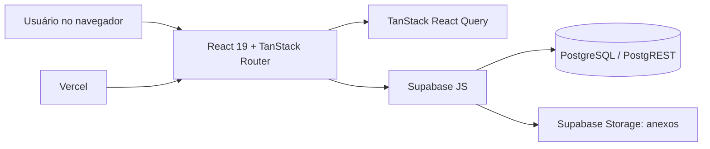

# Arquitetura e stack

## Frontend

- **Vite 7** compila a SPA; `vite.config.ts` define porta 8080, host IPv6, diretório `dist` e plugins React, Tailwind e TanStack Router.
- **React 19 + TypeScript** formam a interface.
- **TanStack Router** cria as rotas a partir de `src/routes`; `routeTree.gen.ts` é gerado automaticamente.
- **TanStack Query** busca e invalida dados após mutations; não há API própria no servidor.
- **Tailwind CSS 4, Radix/shadcn e Lucide** compõem UI e ícones. Sonner mostra notificações.
- A navegação usa sidebar fixa a partir de `md` (768 px) e, abaixo desse ponto, cabeçalho compacto com menu lateral deslizante. As páginas reduzem o espaçamento lateral em celular (`p-4`), ampliando progressivamente em telas maiores.

## Backend

O navegador chama diretamente o Supabase via `@supabase/supabase-js`: tabelas pelo PostgREST, funções pelo `rpc()` e arquivos pelo Storage. Não há Edge Function, servidor Node, controller REST próprio ou camada de domínio no backend.

## Organização do código

| Local | Função |
|---|---|
| `src/routes/` | Páginas e maior parte das consultas/mutações. |
| `src/components/` | Sidebar, formulário de planejamento, diálogos de replicação/exclusão e componentes de UI. |
| `src/services/` | Wrappers CRUD tipados para quatro cadastros e planejamentos; as rotas também fazem consultas diretas. |
| `src/lib/` | Contexto de autenticação, tipos de domínio, feriados, backup e utilitários. |
| `src/integrations/supabase/` | Cliente Supabase e tipos gerados. |
| `supabase/migrations/` | Evolução do banco. |

## Cache e consistência de tela

As consultas usam chaves como `docentes`, `planejamentos`, `laboratorio_agendamentos` e `solicitacoes_laboratorio`. Depois de gravar, a tela correspondente invalida a chave. Não há assinaturas realtime; a sidebar consulta pendências de laboratório a cada 60 segundos.
