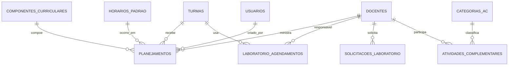

# Modelo de dados

## Entidades

| Tabela | Campos relevantes | Relações/regras |
|---|---|---|
| `docentes` | `nome`, `cor_identificadora`, `ativo` | Referenciada por planejamentos, laboratório, AC e usuários. |
| `componentes_curriculares` | `nome`, `ativo`, `usa_laboratorio` | Referenciada por planejamentos, laboratório e solicitações. |
| `turmas` | `serie`, `nome`, `ativo` | Referenciada por planejamentos, laboratório e solicitações. |
| `horarios_padrao` | `label`, `hora_inicio`, `hora_fim`, `ordem`, `ativo`, `eh_intervalo` | Slot temporal para agenda, laboratório e AC. |
| `planejamentos` | `data`, FKs de horário/docente/componente/turma, `conteudo`, `anexo_url`, `status`, `criado_por`, timestamps | Aula formal. Status: `planejado`, `realizado`, `cancelado`. |
| `laboratorio_agendamentos` | `data`, horário, turma, docente/componente opcionais, recursos, `status`, `criado_por` | Uso físico do laboratório. Status: `agendado`, `realizado`, `cancelado`. |
| `solicitacoes_laboratorio` | dados de aula, recursos, `status`, motivo e auditoria de decisão | Fluxo pendente/aprovado/rejeitado. |
| `categorias_ac` | `nome`, `ativo` | Catálogo de AC. |
| `atividades_complementares` | docente, data, horário, categoria, observação, criador | Uma AC por docente/data/horário. |
| `mural_publicacoes` | título, conteúdo, tipo, evento, período de exibição, fixação e status | Alimenta o mural escolar; eventos exigem data. |
| `feriados` | `nome`, `data`, `tipo`, `ativo` | Feriados municipais/nacionais cadastrados. |
| `usuarios` | `usuario`, `nome`, `senha`, `tipo`, `ativo`, `primeiro_login`, `docente_id` | Perfis `admin` ou `usuario`; vínculo opcional ao docente. |

## Relacionamentos

## Índices e integridade

- `planejamentos`: índices únicos parciais para `(data, horario_id, docente_id)` e `(data, horario_id, turma_id)` quando o status não é `cancelado`; índice por data e por criador. Um trigger atualiza `updated_at`.
- `atividades_complementares`: unicidade em `(docente_id, data, horario_id)`.
- Laboratório: a migration mais recente removeu a unicidade de data/horário; múltiplos agendamentos no mesmo slot são permitidos e apresentados como aviso visual.
- As FKs usam majoritariamente `RESTRICT`, `CASCADE` ou `SET NULL`, conforme a entidade. A exclusão de registros referenciados pode portanto falhar ou remover dependências.

## Storage

O bucket público `anexos` armazena arquivos dos planejamentos. A URL pública vai em `planejamentos.anexo_url`; o arquivo não é uma FK e pode permanecer órfão se a aula for excluída sem remoção do objeto.
