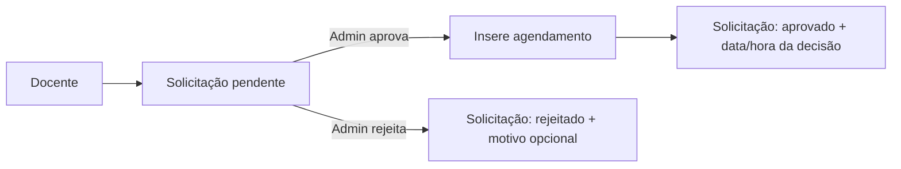

# Regras de negócio e fluxos

## Planejamento de aulas

1. A aula exige data, horário, docente, componente e turma ativos.
2. A base impede, para registros não cancelados, que o mesmo docente ou a mesma turma ocupem dois planejamentos no mesmo dia/horário.
3. Aulas canceladas deixam de participar dessa trava. Estados possíveis: planejado, realizado e cancelado.
4. `ReplicarAulasDialog` gera aulas em massa para um intervalo e dias da semana selecionados, consultando conflitos antes de inserir.
5. `ExcluirAulasMassaDialog` permite remover planejamentos por período e filtros. Para usuário comum, aplica escopo de proprietário quando fornecido.

## Laboratório

- Uma solicitação contém docente, turma, componente, data, horário, conteúdo e demanda por projetor/som.
- Toda solicitação pendente aparece em amarelo na grade semanal para todos os usuários, com o rótulo **Solicitado**. A grade não identifica quem solicitou; a lista de solicitações do docente permanece individual.
- A aprovação e a rejeição usam RPCs transacionais: a aprovação cria o agendamento e muda o estado da solicitação em uma única operação, evitando estados parciais e dupla decisão concorrente.
- A agenda do laboratório é independente de `planejamentos`, pois uma aula normal pode usar o laboratório no próprio horário.
- A migration atual deliberadamente permite múltiplos agendamentos no mesmo horário de laboratório; a interface sinaliza visualmente a sobreposição.

## Feriados e relatórios

- Os feriados nacionais fixos estão codificados em `src/lib/feriados.ts`; a tabela armazena feriados adicionais e seu status.
- `eh_intervalo` em `horarios_padrao` faz relatórios destacarem o recreio em vez de tratá-lo como vaga.
- ACs não interferem na agenda normal: sua unicidade própria é docente/data/horário e seu lançamento ocorre pelo relatório de docente.

## Backup

O backup v2 exporta docentes, componentes, turmas, horários, feriados, categorias de AC, planejamentos, agendamentos e solicitações de laboratório e atividades complementares. A restauração apaga essas tabelas em ordem inversa e reinsere os registros em lotes de 500. Não inclui usuários, anexos do Storage nem configurações externas.
