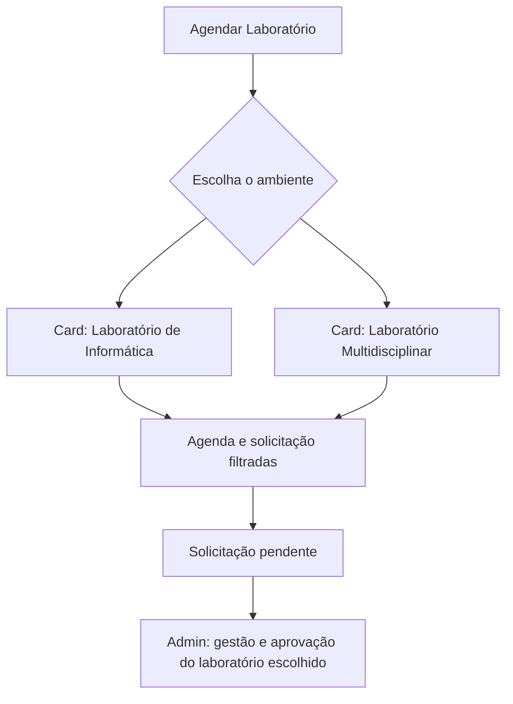

# Expansão: Laboratório Multidisciplinar

## Objetivo

Adicionar o **Laboratório Multidisciplinar** com o mesmo ciclo do Laboratório de Informática: consulta de disponibilidade, solicitação pelo docente, aprovação/rejeição e gestão administrativa. A escolha do ambiente acontece antes da agenda, por dois cards.

## Decisão de arquitetura

Os ambientes serão configuráveis por dados, não por cópias de telas/tabelas. Será criada a tabela `laboratorios`, inicialmente com:

| Slug | Nome | Comportamento inicial |
|---|---|---|
| `informatica` | Laboratório de Informática | Recebe os registros históricos já existentes. |
| `multidisciplinar` | Laboratório Multidisciplinar | Agenda vazia; não recebe preenchimento automático por componentes de Computação. |

`laboratorio_agendamentos` e `solicitacoes_laboratorio` passarão a ter `laboratorio_id`. Assim, data e horário só bloqueiam/alertam dentro do mesmo laboratório.

## Responsáveis e aprovação segregada

Além de administrador e docente, haverá a permissão de **responsável de laboratório**. A associação será mantida em uma tabela de permissões (`usuarios_laboratorios`), permitindo que um responsável administre um ou mais ambientes sem precisar criar papéis fixos para cada laboratório.

| Perfil | Pode visualizar/aprovar |
|---|---|
| Administrador | Todos os laboratórios. |
| Responsável do Laboratório de Informática | Somente solicitações e agenda de Informática. |
| Responsável do Laboratório Multidisciplinar | Somente solicitações e agenda Multidisciplinar. |
| Docente | Próprias solicitações e disponibilidade pública, sem decidir pedidos. |

A tela de aprovação será filtrada na origem pela associação do usuário. A RPC de aprovação/rejeição também receberá o `laboratorio_id` e validará a permissão no banco; esconder um card no frontend não será a única barreira.

## Fluxo de navegação

## Telas propostas

1. **Hub de laboratórios** — nova rota que exibe os dois cards e direciona à agenda do ambiente escolhido.
2. **Agenda/solicitação** — reutiliza a tela existente, recebendo o laboratório pela URL; pendências e ocupações ficam isoladas por ambiente.
3. **Gestão de laboratórios** — seção própria no menu. Administradores acessam os dois ambientes e definem seus responsáveis; cada responsável acessa somente sua agenda e suas aprovações.
4. **Relatórios** — seletor de laboratório para gerar a ocupação de cada ambiente sem misturar registros.

## Migration e compatibilidade

- Criar `laboratorios` e inserir os dois ambientes.
- Adicionar `laboratorio_id` às tabelas de agendamento e solicitação.
- Vincular todo o histórico existente ao Laboratório de Informática.
- Atualizar índices e RPCs de aprovação/rejeição para usar o ambiente selecionado.
- Criar `usuarios_laboratorios` e validar essa associação nas RPCs de aprovação/rejeição.
- Incluir `laboratorios` no backup v2 e manter backup/restauração em ordem compatível com as FKs.
- Preservar rotas antigas com redirecionamento para o hub ou para Informática, evitando links quebrados.

## Critérios de aceite

- Um pedido pendente aparece em amarelo somente na agenda do laboratório solicitado.
- A mesma data/horário pode ser usado simultaneamente em laboratórios diferentes.
- A aprovação cria reserva no laboratório correto.
- O novo laboratório começa sem registros importados dos componentes de Computação.
- Administradores conseguem gerir e aprovar os dois ambientes.
- O responsável de um laboratório não consegue visualizar nem decidir solicitações do outro, pela interface ou pela RPC.
- Backup, restauração e relatório incluem os dois ambientes.
