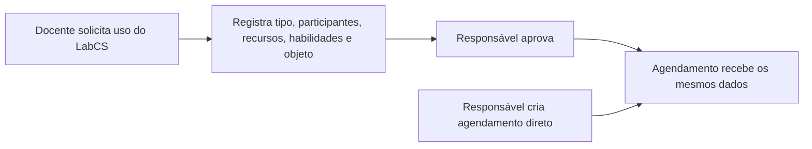

# Especificação: LabCS — Laboratório de Conexões e Saberes

## Objetivo

Renomear o atual ambiente de slug `multidisciplinar` para **LabCS - Laboratório de Conexões e Saberes** e complementar seus registros de uso com informações pedagógicas. A alteração é exclusiva do LabCS; o fluxo e os campos do Laboratório de Informática permanecem como estão.

## Dados a registrar no LabCS

| Campo | Tipo de preenchimento | Regra |
|---|---|---|
| Tipo de atividade | Escolha única: `Aula prática` ou `Oficina pedagógica` | Obrigatório no LabCS. |
| Alunos participantes | Texto livre, no formato que o docente preferir | Obrigatório quando o tipo for `Oficina pedagógica`; não exibido para aula prática. |
| Recursos utilizados e quantidade | Texto livre | Obrigatório no LabCS. Exemplo: `15 tablets; 2 caixas de lápis de cor; 1 projetor`. |
| Habilidades | Texto livre | Obrigatório no LabCS. |
| Objeto do conhecimento | Texto livre | Obrigatório no LabCS. |

O campo de recursos será um único campo textual, como Conteúdo, pois o pedido não requer inventário, saldo ou reserva individual de materiais. A quantidade será descrita pelo usuário junto de cada recurso.

## Alcance dos fluxos

Os dados devem existir tanto em **solicitações** feitas por docentes quanto em **agendamentos** feitos por administradores/responsáveis. Isso evita que as informações pedagógicas se percam quando uma solicitação é aprovada.

> Decisão confirmada em 02/09/2026: os campos fazem parte dos dois fluxos e devem ser preservados integralmente da solicitação até o agendamento aprovado.

## Modelo técnico proposto

1. Criar uma migration que atualize apenas o nome do registro `laboratorios.slug = 'multidisciplinar'` para `LabCS - Laboratório de Conexões e Saberes`.
2. Adicionar, em `laboratorio_agendamentos` e `solicitacoes_laboratorio`, colunas anuláveis para manter compatibilidade com o histórico e com o Laboratório de Informática:
   - `tipo_atividade` (`aula_pratica` ou `oficina_pedagogica`);
   - `alunos_participantes` (texto);
   - `recursos_utilizados` (texto);
   - `habilidades` (texto);
   - `objeto_conhecimento` (texto).
3. Alterar a RPC `aprovar_solicitacao_laboratorio` para copiar essas cinco informações da solicitação aprovada para o agendamento criado.
4. Atualizar os tipos gerados do Supabase e os tipos/seletores locais usados na agenda.
5. Exibir e validar os campos apenas quando o laboratório atual tiver o slug `multidisciplinar`. Nos demais ambientes, os campos permanecem ausentes da interface e nulos no banco.

## Telas e pontos de alteração

| Área | Mudança prevista |
|---|---|
| Hub de laboratórios | O card do ambiente passa a mostrar o novo nome vindo do banco. |
| Solicitar laboratório | Quando LabCS for selecionado, incluir o tipo de atividade e os quatro campos adicionais; condicionar participantes a Oficina pedagógica. |
| Agenda administrativa | Aplicar os mesmos campos, regras e edição no formulário de agendamento direto do LabCS. |
| Aprovações | Preservar os dados na aprovação; considerar exibi-los no detalhe da solicitação. |
| Grade e relatório do laboratório | Exibir pelo menos tipo da atividade e recursos de forma resumida, preservando os demais dados no diálogo/detalhe para não poluir a grade. |
| Documentação | Atualizar modelo de dados, regras de laboratório e histórico de migrations após a execução. |

## Reformulação do relatório de laboratório

O relatório atual é legado: tem título fixo de **Laboratório de Informática**, não possui seletor de ambiente e consulta todos os agendamentos juntos. Portanto, ele não representa corretamente a estrutura atual de dois laboratórios nem as informações pedagógicas do LabCS.

### Proposta funcional

Transformar a aba atual em **Relatório de uso dos laboratórios**, mantendo a exportação em PDF e acrescentando:

| Elemento | Comportamento proposto |
|---|---|
| Laboratório | Seletor obrigatório. Cada emissão trata um ambiente por vez, com o nome vindo do cadastro. |
| Período | Manter data inicial e final. |
| Visões | Preservar a grade de disponibilidade e acrescentar uma lista detalhada de usos. |
| Grade de disponibilidade | Mostrar somente o laboratório escolhido; suportar mais de um uso no mesmo horário, como a regra atual permite. |
| Lista detalhada | Data, horário, turma, docente, componente, status e, no LabCS, tipo de atividade, participantes quando houver, recursos/quantidades, habilidades e objeto do conhecimento. |
| PDF | Título, nome do arquivo e cabeçalho usam o laboratório selecionado; os detalhes pedagógicos do LabCS entram na versão de lista. |

O relatório geral, a grade do docente e as atividades complementares não serão removidos nessa entrega. Eles serão revisados separadamente em uma próxima etapa de diagnóstico, pois seus objetivos e filtros atuais são diferentes do relatório de uso de laboratório.

> Decisão confirmada em 02/09/2026: a reformulação dos relatórios é necessária porque a versão atual ainda reflete o modelo anterior. A primeira entrega deve corrigir o relatório de laboratório, diretamente impactado pelo LabCS; o restante da área de relatórios será inventariado antes de qualquer substituição.

## Critérios de aceite

- O ambiente aparece como **LabCS - Laboratório de Conexões e Saberes** em todos os pontos que usam seu nome.
- No LabCS não é possível salvar uma solicitação ou agendamento sem tipo, recursos, habilidades e objeto do conhecimento.
- Ao selecionar Oficina pedagógica, a lista de alunos participantes passa a ser obrigatória.
- Ao selecionar Aula prática, o campo de participantes não é exibido e seu valor é limpo antes do salvamento.
- Os novos campos não aparecem nem são obrigatórios no Laboratório de Informática.
- A aprovação de uma solicitação do LabCS cria o agendamento correspondente com todos os dados pedagógicos preservados.
- Agendamentos e solicitações históricos continuam acessíveis, mesmo sem os novos dados.

## Verificação após implementação

1. Aplicar a migration no projeto Supabase e regenerar tipos.
2. Validar criação e edição de Aula prática no LabCS.
3. Validar criação de Oficina pedagógica, inclusive bloqueio sem participantes.
4. Validar aprovação e conferir a cópia integral dos campos para `laboratorio_agendamentos`.
5. Confirmar que o formulário do Laboratório de Informática não foi alterado.
6. Emitir o PDF de cada laboratório e confirmar que seus dados não são misturados.
7. Emitir a lista detalhada do LabCS e confirmar a presença dos dados pedagógicos.

## Registro de execução — 02/09/2026

- Migration criada para renomear o ambiente, adicionar os cinco campos e preservar os dados na RPC de aprovação.
- Formulários de solicitação e agendamento direto ajustados exclusivamente para o slug `multidisciplinar`.
- Aprovações passaram a exibir os dados pedagógicos registrados.
- Relatório de laboratório agora seleciona o ambiente antes da consulta e usa seu nome no PDF; a lista exportada inclui os dados do LabCS.
- Hub de laboratórios passou a usar o nome cadastrado no banco, com fallback para o nome oficial do LabCS.
- Formulários extensos do LabCS usam altura limitada à viewport, rolagem interna e rodapé fixo para manter as ações acessíveis em telas menores.
- A aplicação da migration remota e a regeneração oficial dos tipos dependem da CLI/credenciais do Supabase, indisponíveis neste ambiente.
