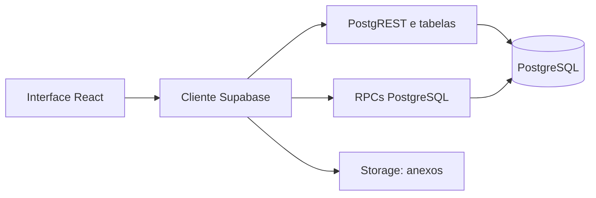

# Guia do Backend e Supabase

## O que é o backend do SGE

O SGE não possui servidor Node ou API REST própria. O navegador se comunica diretamente com o Supabase por meio do cliente `@supabase/supabase-js`.

Isso torna as **políticas RLS**, as **RPCs** e as **migrations** parte essencial da segurança e das regras de negócio.

## Onde encontrar cada parte

| Necessidade | Local de referência | Observação |
|---|---|---|
| Estrutura e relações do banco | [[04-Modelo-de-dados]] | Consulte antes de criar campos ou remover dados. |
| Migrations e sua ordem | `supabase/migrations/` e [[11-Historico-de-migrations]] | Aplicar em ambiente correto e registrar qualquer aplicação manual. |
| Consultas e RPCs usadas pela interface | [[05-API-e-servicos]] e `src/lib/db.ts` | Algumas telas ainda usam consultas diretas. |
| Login, perfis e riscos | [[07-Autenticacao-e-seguranca]] | Tema prioritário para revisão. |
| Ambiente, deploy e backup | [[08-Operacao-deploy-e-backup]] | Inclui variáveis e recuperação. |

## Processo seguro para mudar o banco

1. Confirmar o requisito funcional e atualizar a especificação correspondente.
2. Criar uma nova migration sem alterar migrations já aplicadas.
3. Aplicar a migration no ambiente correto e confirmar sucesso.
4. Regenerar `src/integrations/supabase/types.ts`.
5. Atualizar consultas, tipos e formulários do frontend.
6. Revisar RLS, permissões de Storage e RPCs afetadas.
7. Testar criação, edição, leitura e exclusão com os perfis envolvidos.
8. Registrar a mudança em [[11-Historico-de-migrations]] e no documento funcional do módulo.

## Regras essenciais de segurança

- Chaves iniciadas por `VITE_` ficam disponíveis no navegador. Somente chave pública pode ser usada nelas.
- A interface não é uma barreira de segurança. Ocultar uma rota ou botão não impede acesso direto à API.
- Toda tabela, função e bucket acessível pelo cliente precisa de política compatível com o perfil do usuário.
- Operações que alteram mais de uma entidade devem preferir RPC transacional para evitar estado parcial.

## Estado que exige decisão

As prioridades de autenticação, transação de aprovação e backup estão detalhadas em [[15-Revisao-Levi-e-Vitor]]. Nenhuma mudança estrutural nesses pontos deve ser iniciada sem registrar a decisão e validar o comportamento no banco remoto.

## Checklist de publicação

- [ ] Migrations aplicadas e registradas.
- [ ] Tipos Supabase regenerados.
- [ ] Variáveis de ambiente conferidas na Vercel.
- [ ] RLS e Storage revisados para os perfis envolvidos.
- [ ] Backup disponível e restauração testada em ambiente isolado quando houver alteração de dados.
- [ ] `npm run lint` e `npm run build` executados com sucesso.

Voltar ao [[00-INDICE-MESTRE-SGE]].
